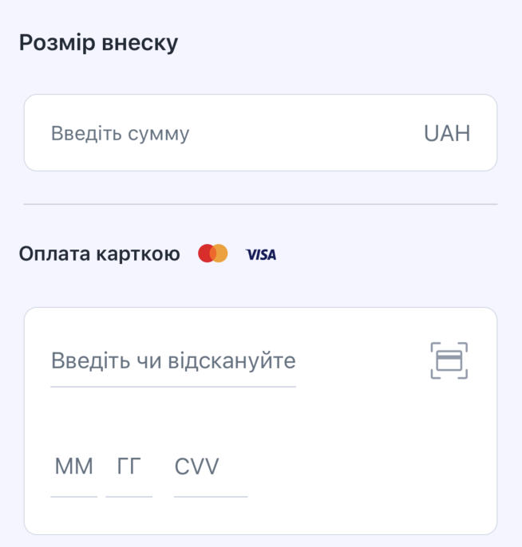

# Payment process diagram


# Requirements
TranzzoPaymentSDK is written in Swift 5+. iOS 11.0+ Required

# Install
With Cocoapods

```ruby
pod 'TranzzoPaymentSDK', :git => 'https://github.com/tranzzo/mobile-sdk-ios.git', :tag => '1.0.4'
```

While using TranzzoPaymentSDK, don’t forget:

```swift
import TranzzoPaymentSDK
```

# SDK configuration
Init the TranzzoPaymentSDK library in the AppDelegate. For example:

```swift
func application(_ application: UIApplication, didFinishLaunchingWithOptions launchOptions: [UIApplication.LaunchOptionsKey: Any]?) -> Bool {
    // Override point for customization after application launch.

    TranzzoPaymentSDK.setConfig(paymentConfig: PaymentsConfig(environment: .sandbox, currency: "currency"))
    
    return true
}
```

Supported server **Environment**:  

```swift
public enum Environment {
    case sandbox
    case production
}
```

### <span style="color:red">**Pay attentsion**</span>.  
>`currency` should be in format <a href="https://en.wikipedia.org/wiki/ISO_4217">ISO 4217</a> 

<br>

# Apple Pay Integration 
1) Setting Up Apple Pay according <a href="https://developer.apple.com/documentation/passkit/apple_pay/setting_up_apple_pay">guide</a> 
2) Pass `ApplePayConfig` into `PaymentsConfig` (by default `ApplePayConfig` is `nil`) 
```swift
    TranzzoPaymentSDK.setConfig(paymentConfig: PaymentsConfig(environment: .sandbox, currency: "your_currency", applePay: ApplePayConfig(merchantId: "yout_merchat_id", countryCode: "country_code")))
```
### <span style="color:red">**Pay attentsion**</span>.  
>`coutryCode` should be in format <a href="https://en.wikipedia.org/wiki/ISO_3166-1_alpha-2#Officially_assigned_code_elements">ISO 3166-1 alpha-2</a> 

<br>

# Customization 

You can easily customize the payment screen **color scheme/localization**. Just implement `PaymentContollerConfig` and pass into `setConfig` method

```swift
var colorConfig = ColorConfig()
colorConfig.pay_button_enable_color = .blue
colorConfig.pay_button_disabled_color = .purple
colorConfig.fixed_amount_color = .blue
colorConfig.background_color = .white
colorConfig.section_backround_color = .cyan
colorConfig.border_color = .lightGray
colorConfig.placeholder_color = .darkGray
colorConfig.title_color = .darkGray
colorConfig.input_color = .black
colorConfig.error_color = .red

var localizationConfig = LocalizationConfig()
localizationConfig.main_title = "main_title"
localizationConfig.enter_amount_title = "enter_amount_title"
localizationConfig.enter_amount_placeholder = "enter_amount_placeholder"
localizationConfig.pay_via_card_title = "pay_via_card_title"
localizationConfig.pay_button_title = "pay_button_title"
localizationConfig.wrong_card_data_title = "wrong_card_data_title"
localizationConfig.card_number_placeholder = "card_number_placeholder"
localizationConfig.card_exp_month_placeholder = "card_exp_month_placeholder"
localizationConfig.card_exp_year_plaecholder = "card_exp_year_plaecholder"
localizationConfig.card_cvv_placeholder = "card_cvv_placeholder"
localizationConfig.cancel_payment_title = "cancel_payment_title"
localizationConfig.cancel_payment_description = "cancel_payment_description"
localizationConfig.cancel_payment_confirm = "cancel_payment_confirm"
localizationConfig.cancel_payment_cancel = "cancel_payment_cancel"

TranzzoPaymentsManager.setConfig(paymentConfig: PaymentsConfig(environment: .sandbox, currency: "your_currency", applePay: ApplePayConfig(merchantId: "yout_merchat_id", countryCode: "your_country_code")), uiConfig: PaymentContollerConfig(colorConfig: colorConfig, localizationConfig: localizationConfig))
```
### <span style="color:red">**Pay attentsion**</span>.  
Ukrainian language is default localization

<br>

#  Prepare payment data for sending:
a) Create `PaymentType` object that contains all necessary information about payment amount type. 
- In case user should have the fixed amount for payment you need to create the next object:
```swift
let paymentType = FixedAmountPaymentType(orderId: "your_order_id",
                                         amount: 0.15,
                                         description: "your_order_description",
                                         tokenCards: [
                                            TokenCardModel(mask: "card_mask", 
                                                           token: "card_token",
                                                           isDefault: true)
                                        ])
```
>`description` is the text will be displayed to user on the payment screen. Please, provide a readable product description.
`tokenCards` - array of already tokenized cards (TokenCardModel), `nil` by default   

The UI example with fixed amount, product description and empty `tokenCards`:


<br>

The UI example with fixed amount, product description and `tokenCards`:


<br>

- In case user can change the amount of payment by themself you need to create the next object:
```swift
let paymentType = AnyAmountPaymentType(orderId: UUID().uuidString,
                                       description: "Test product",
                                       proposedAmounts: [9.99, 14.99, 29.99], // Decimal array
                                       tokenCards: [
                                            TokenCardModel(mask: "card_mask", 
                                                           token: "card_token",
                                                           isDefault: true)
                                        ])

```
>`proposedAmounts` - array of already predefined amount values, `nil` by default
`description` - text will be displayed to user on the payment screen. Please, provide a readable product description.
`tokenCards` - array of already tokenized cards (TokenCardModel), `nil` by default   

The UI example with free to change amount, description, empty `proposedAmounts`, empty `tokenCards`.


<br>

The UI example with free to change amount, `proposedAmounts`,product description and empty `tokenCards`:


<br>

The UI example with free to change amount, `proposedAmounts`,product description and `tokenCards`:


b) Create `KeyConfig` object:
```swift
let keyConfig = KeyConfig(sessionToken: "your_session_token",
                        apiKey: "your_api_key",
                        posId: "your_pos_id")
```

<br>

c) Create `CustomerData` object that contains all your necessary data:
```swift
let customerData = CustomerData(customerEmail: "customerEmail", // required
                                customerPhone: "customerPhone", // required
                                customerId: "customerId", // optinal
                                customerFname: "customerFname", // optinal
                                customerLname: "customerLname", // optinal
                                customerLang: "customerLang", // optinal
                                customerCountry: "customerCountry" // optional 
                                )
```

> `customerLang` supported values: 
"EN", "RU", "ES", "PL", "AR", "AZ", "BG", "CS", "DA", "DE", "EL", "FA", "FI", "FR", "HE", "HI", "HR", "HU", "IT", "JA", "KO", "NL", "NO", "PT", "PT_BR", "RO", "SK", "SL", "SR", "Ї", "SV", "TH", "TR", "UK", "ZH", "ZH_HA"


<br>

d) Create `AdditionalData` object that contains all additional information. 
```swift 
let additionalData = AdditionalData(method: .purchase, 
                                    serverUrl: nil,
                                    products: nil,
                                    merchantMcc: nil,
                                    payload: nil)
```
>`method` - payment method according with your business. Supported types:
``` swift
  public enum PaymentMethodType: String, Codable {
      case auth // two-step payment. Amount is simply hold on payer's card. For actual charging, complete the transaction with capture method.
      case purchase // one-step payment. Charges customer's card for specified amount (used by default)
  }
```

>`serverUrl` - callback url on your server \
`products` - array of products that are being paid for. \
`merchantMcc` - MCC for this transaction. \
`payload` - custom string data. Max 4000 symbols.

**All field can be `nill`.** 

<br>


# Make a request for payment processing

```swift
func someFunc() {
    TranzzoPaymentSKD.makePayment(rootController: self,
                                  delegate: self,
                                  paymentData: PaymentData(type: paymentType,
                                                           keyConfig: keyConfig,
                                                           customerData: customerData,
                                                           additionalData: customerData)
    )
}
```
`rootController` - UIViewController for displaying PaymentController

`delegate` -     delegate

`paymentData` - object that contains `PaymentType`, `KeyConfig`, `CustomerData` and `AdditionalData`

<br>

# Handling payment status

```swift
func paymentSuccess(_ results: PaymentInfoResponse)
```
>Method fire when Payment was successfully. Return `PaymentInfoResponse` object that contains all information about payment

### PaymentStatus
```swift
public enum PaymentStatus: String, Codable {
    case pending
    case failure
    case success
}
```

#### SUCCESS

This status indicates that the transaction has been processed successfully.

#### FAILURE

This status indicates that the transaction has been rejected. The reasons for this may include 
specific errors at any stage of the payment process, such as incorrect payment data, activation 
of limits and checks, insufficient funds, and so on.

#### PENDING

This status is applicable to all types of transactions and indicates that the transaction is being 
processed by the bank or payment system. The SDK checks this status on its own and re-requests the 
status until it receives SUCCESS or FAILURE. But if the status does not change within 60 seconds, 
the client receives the PENDING status.


<br>

```swift
func paymentFailed(_ error: TranzzoError)
```
>Method fire when Payment was failed. Return `TranzzoError` object that contains short info about error
<br>

```swift
func paymentCanceled()
```
>Method fire when user canceled Payment on any processing step
